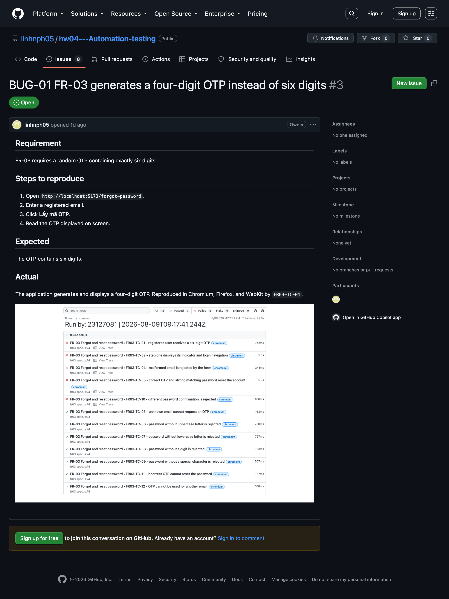
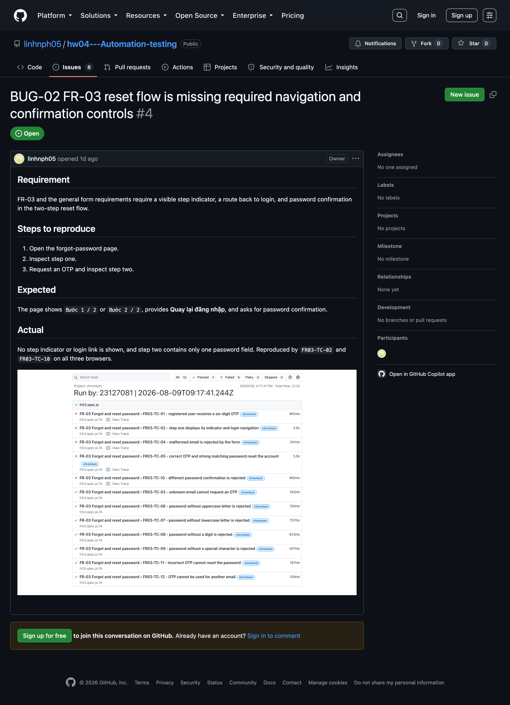
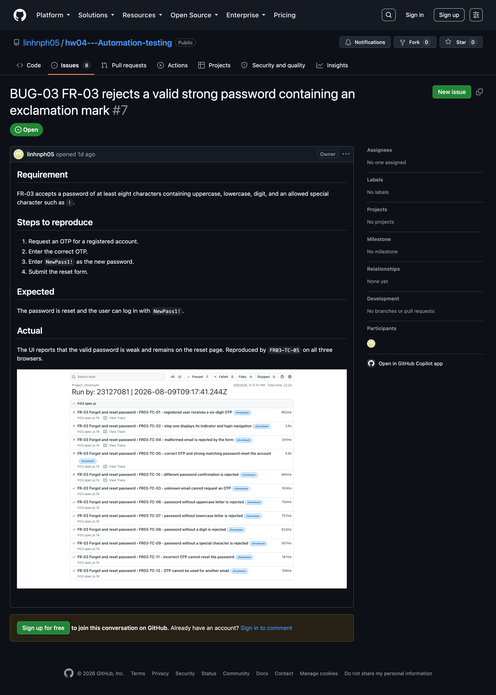
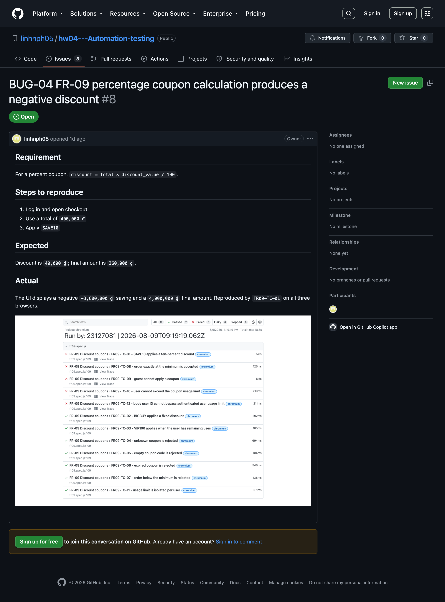
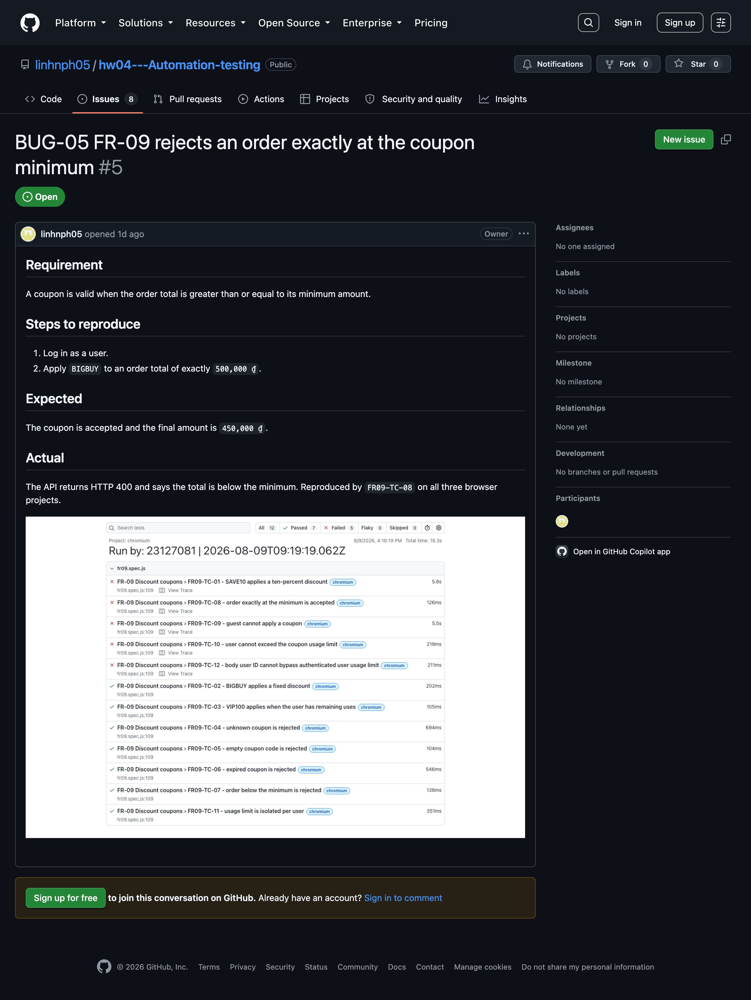
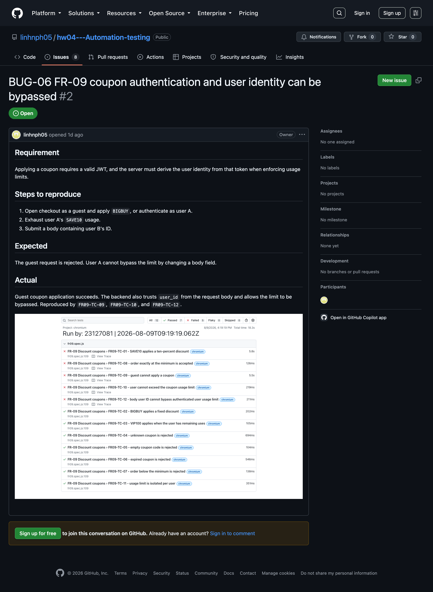
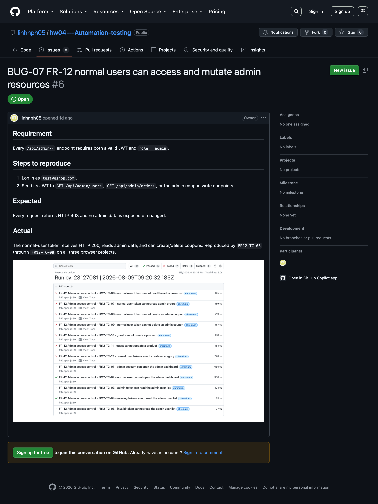
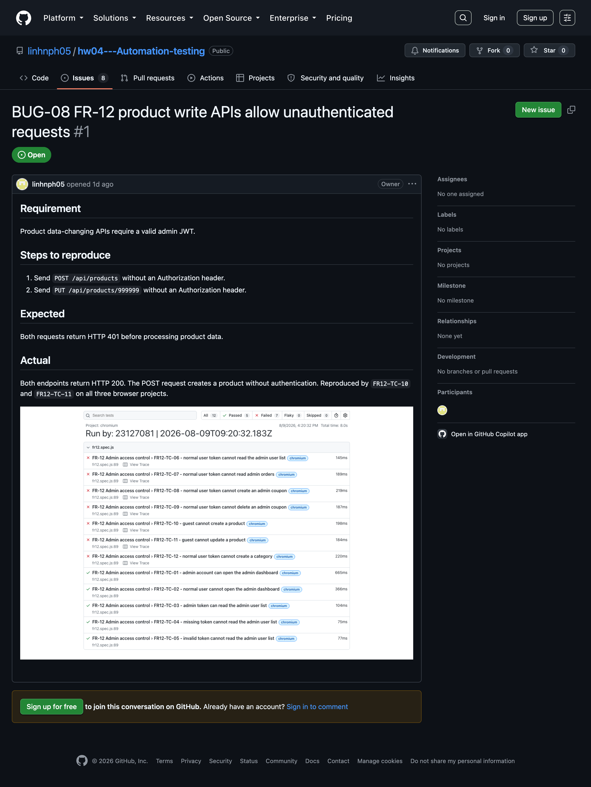

# Bug Report

Each issue includes a screenshot from a real Playwright HTML report.

| ID | Feature | Summary | Affected tests | GitHub Issue |
| --- | --- | --- | --- | --- |
| BUG-01 | FR-03 | OTP contains four digits instead of six | FR03-TC-01 | [#3](https://github.com/linhnph05/hw04---Automation-testing/issues/3) |
| BUG-02 | FR-03 | Step indicator, login navigation, and confirmation field are missing | FR03-TC-02, FR03-TC-10 | [#4](https://github.com/linhnph05/hw04---Automation-testing/issues/4) |
| BUG-03 | FR-03 | Valid `NewPass1!` password is rejected | FR03-TC-05 | [#7](https://github.com/linhnph05/hw04---Automation-testing/issues/7) |
| BUG-04 | FR-09 | Percentage formula gives a negative discount | FR09-TC-01 | [#8](https://github.com/linhnph05/hw04---Automation-testing/issues/8) |
| BUG-05 | FR-09 | Exact minimum amount is rejected | FR09-TC-08 | [#5](https://github.com/linhnph05/hw04---Automation-testing/issues/5) |
| BUG-06 | FR-09 | Guests and fake user IDs can bypass coupon rules | FR09-TC-09, TC-10, TC-12 | [#2](https://github.com/linhnph05/hw04---Automation-testing/issues/2) |
| BUG-07 | FR-12 | Normal users can read and change admin data | FR12-TC-06 to TC-09, TC-12 | [#6](https://github.com/linhnph05/hw04---Automation-testing/issues/6) |
| BUG-08 | FR-12 | Guests can create or update products | FR12-TC-10, TC-11 | [#1](https://github.com/linhnph05/hw04---Automation-testing/issues/1) |

The same results appeared in Chromium, Firefox, and WebKit. The table links to the full GitHub Issues. The screenshots below show each public issue page.

## GitHub Issue Page Screenshots

### BUG-01 - GitHub Issue #3

### BUG-02 - GitHub Issue #4

### BUG-03 - GitHub Issue #7

### BUG-04 - GitHub Issue #8

### BUG-05 - GitHub Issue #5

### BUG-06 - GitHub Issue #2

### BUG-07 - GitHub Issue #6

### BUG-08 - GitHub Issue #1

